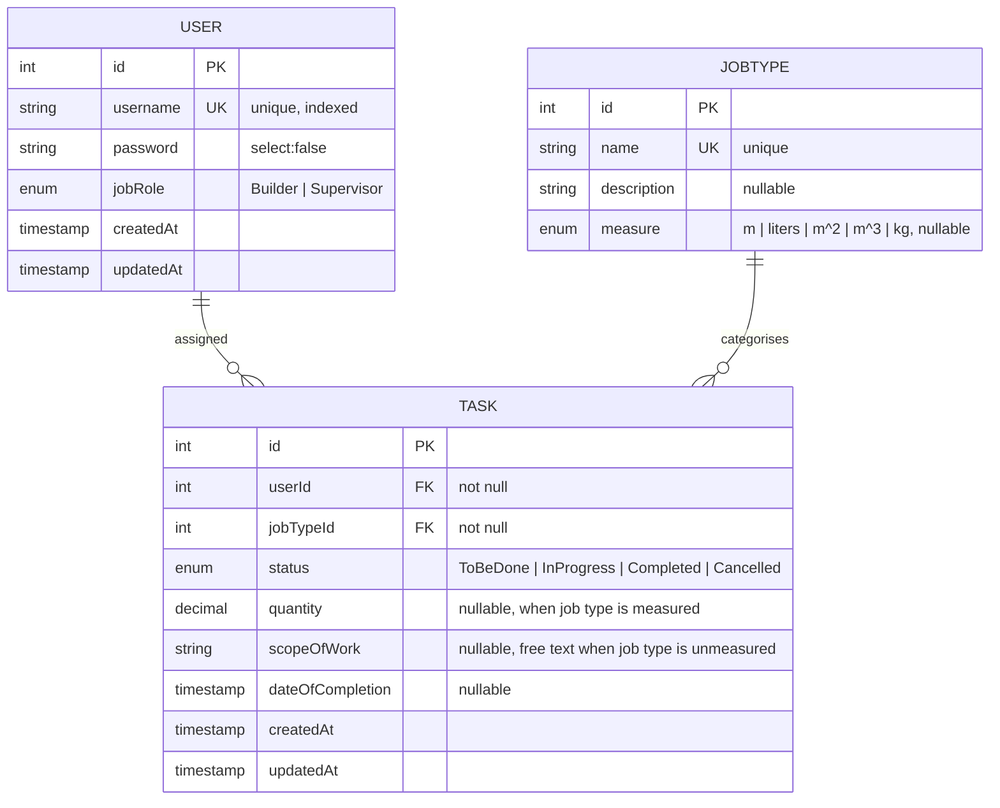

# Data Model

> **Summary:** The three persisted entities — `User`, `JobType`, `Task` — their columns, and their relationships.
> **Read this when:** You're adding a column, changing a relationship, or writing a query.
> **Audience:** both
> **Related:** [Modules](modules.md) · [Configuration](../reference/configuration.md) · [Deployment](../guides/deployment.md)

[← Back to docs index](../INDEX.md)

---

## TL;DR

A `Task` ties one `User` to one `JobType` and tracks a status. Both relationships are **required** (`nullable: false`). Schema is managed by TypeORM with `synchronize` **on outside production** — there are no migration files. Source of truth for every detail below is the `*.entity.ts` files.

## Entity-relationship diagram

## `User` — `src/users/users.entity.ts`

| Column | Type | Notes |
|--------|------|-------|
| `id` | int | Primary key, auto-generated |
| `username` | varchar(255) | Unique, not null, indexed as `IDX_user_username` |
| `password` | varchar(255) | Not null, **`select: false`** — excluded from queries unless explicitly re-selected |
| `jobRole` | enum | `Builder` \| `Supervisor`, default `Builder` |
| `tasks` | relation | `OneToMany` → `Task.user` |
| `createdAt` / `updatedAt` | timestamp | Managed by TypeORM |

The password is hidden by default; `UsersRepository.findOneByUsernameWithPassword` re-adds it with a query builder for credential checks.

## `JobType` — `src/job-type/job-type.entity.ts`

| Column | Type | Notes |
|--------|------|-------|
| `id` | int | Primary key, auto-generated |
| `name` | varchar(255) | Unique, not null |
| `description` | varchar(500) | Nullable; free-text description of the job type |
| `measure` | enum | `m` \| `liters` \| `m^2` \| `m^3` \| `kg`; **nullable** (empty = unmeasured) |
| `tasks` | relation | `OneToMany` → `Task.jobType` |

## `Task` — `src/tasks/tasks.entity.ts`

| Column | Type | Notes |
|--------|------|-------|
| `id` | int | Primary key, auto-generated |
| `user` | relation | `ManyToOne` → `User.tasks`, **not null** (FK column `userId`) |
| `jobType` | relation | `ManyToOne` → `JobType`, **not null** (FK column `jobTypeId`) |
| `status` | enum | `ToBeDone` \| `InProgress` \| `Completed` \| `Cancelled`, default `ToBeDone` |
| `quantity` | decimal(12,2) | Nullable; amount of work done, in the job type's `measure`. Read back as a number via a column transformer |
| `scopeOfWork` | varchar(500) | Nullable; free-text description of work done, used when the job type is **unmeasured** |
| `dateOfCompletion` | timestamp | Nullable; setting it forces `status = Completed` (in the service) |
| `createdAt` / `updatedAt` | timestamp | Managed by TypeORM |

`TasksRepository` always eager-loads `user` and `jobType` via `relations` so responses can include the username, job-type name, and the job type's `measure`.

### Scope-of-work rule

`quantity` and `scopeOfWork` are validated against the job type's `measure` in `TasksService.validateScope` (raises `400`):

- **Measured** job type (`measure` set) → records a positive numeric `quantity`; free-text `scopeOfWork` is rejected.
- **Unmeasured** job type (`measure` null) → records free-text `scopeOfWork`; `quantity` is rejected.
- The two are mutually exclusive, and both are **optional** (validated only when provided), so a task can be created before any work is reported and the scope filled in later via `PATCH`.

## Enums

| Enum | Values | Defined in |
|------|--------|------------|
| `UserJobRole` | `Builder`, `Supervisor` | `src/users/users.dto.ts` |
| `TaskStatus` | `ToBeDone`, `InProgress`, `Completed`, `Cancelled` | `src/tasks/tasks.dto.ts` |
| `Measure` | `m`, `liters`, `m^2`, `m^3`, `kg` | `src/job-type/job-type.dto.ts` |

> **Gotcha:** enum columns must declare `type: 'enum'` explicitly (e.g. `@Column({ type: 'enum', enum: UserJobRole })`). Without it, TypeORM 1.0 types the column as `Object` and MySQL rejects it.

## Schema management

- TypeORM `synchronize` is enabled whenever `NODE_ENV !== 'production'` (`src/infrastructure/database/database.module.ts`). It auto-creates/updates tables from the entities at boot.
- There are **no migration files**. Production (`NODE_ENV=production`) runs with `synchronize: false`, so schema must be applied another way. See [Deployment](../guides/deployment.md#schema--migrations).
- Entities are discovered by glob: `__dirname + '/../../**/*.entity{.ts,.js}'`.

---

*Next: [Modules](modules.md) · [Deployment](../guides/deployment.md) · back to the [index](../INDEX.md).*
