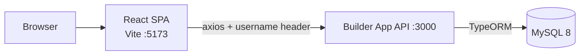
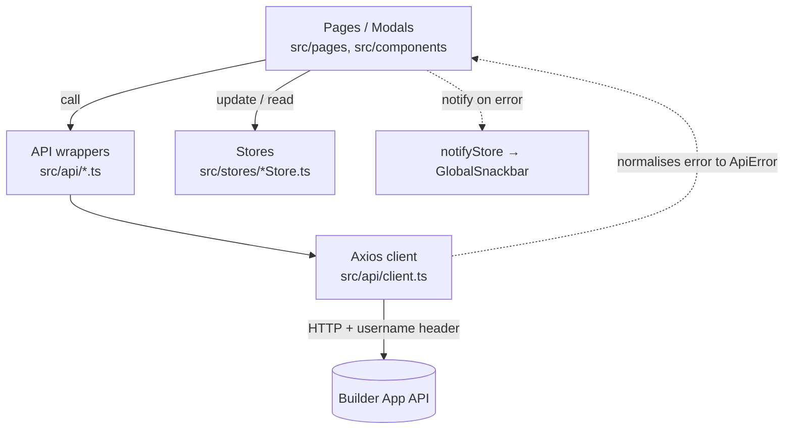

# Frontend Architecture

> **Summary:** How the React single-page app in `frontend/` is structured — its stack, the layers (pages → api wrappers / stores → backend), routing, state management, and how it authenticates against the NestJS API.
> **Read this when:** You're changing the web client and need the big picture before touching pages, stores, or the API layer.
> **Audience:** both
> **Related:** [Overview](overview.md) · [Frontend guide](../guides/frontend.md) · [API Reference](../reference/api.md) · [ADR-0003 Header auth](decisions/0003-header-based-authentication.md)

[← Back to docs index](../INDEX.md)

---

## TL;DR

The frontend is a **Vite + React 19 + TypeScript single-page app** in `frontend/`, separate from the NestJS backend at the repo root. It uses **Material UI (MUI)** for components, **Zustand** for state, **React Router** for navigation, and **Axios** for HTTP. The shape to remember: **pages and modals call thin typed `api/` wrappers, push results into Zustand stores that act as caches, and a shared Axios client injects the `username` auth header and normalises every error**. Components report failures themselves via the `notifyStore` → global snackbar. Types in `src/types/api.ts` mirror the backend DTOs by hand.

## System context

The SPA is one HTTP client of the [Builder App API](overview.md#system-context). Vite serves it in development (port `5173`). It authenticates with the same **`username` header** the backend expects (see [ADR-0003](decisions/0003-header-based-authentication.md)) — there is no token.

The API base URL comes from `VITE_API_URL` (default `http://localhost:3000`). The backend's CORS origin must allow the SPA via `FRONTEND_URL` — see [Configuration](../reference/configuration.md).

## Tech stack

| Concern | Choice | Notes |
|---------|--------|-------|
| Build / dev server | **Vite 8** | `frontend/vite.config.ts`; dev port `5173`; `@` → `./src` alias |
| Language | **TypeScript 6** (strict) | `frontend/tsconfig.json`, target ES2020, `@/*` path alias |
| UI runtime | **React 19** | `react`, `react-dom`; `StrictMode` in `src/main.tsx` |
| Components | **MUI 9** | `@mui/material`, `@mui/icons-material`, `@mui/x-data-grid`; Emotion styling |
| State | **Zustand 5** | one store per concern; auth uses the `persist` middleware |
| Routing | **React Router 7** | `BrowserRouter` in `src/App.tsx` |
| HTTP | **Axios 1** | one shared instance with interceptors in `src/api/client.ts` |
| Fonts / theme | Google Fonts (Space Grotesk, Syne) + a dark MUI theme | loaded in `index.html`; theme in `src/theme.ts` |

## Layered structure

A view never calls Axios directly. It calls a typed `api/` wrapper, then updates a Zustand store (which is mostly a client-side cache).

| Layer | Responsibility | Location |
|-------|----------------|----------|
| Pages | Route-level screens; fetch on mount, render MUI `DataGrid` / cards, open modals, handle delete | `frontend/src/pages/` |
| Components / Modals | Reusable UI and dialogs — view (read-only), create, edit, profile; controlled forms call `api/` wrappers | `frontend/src/components/` |
| Stores | Hold cached domain state (`list`, `loading`) + `fetch` and local `add`/`replace`/`remove` mutators | `frontend/src/stores/` |
| API wrappers | One typed function per endpoint; return parsed data | `frontend/src/api/` |
| Client | Shared Axios instance: base URL, inject `username` header, normalise errors | `frontend/src/api/client.ts` |
| Types | Hand-maintained mirrors of backend DTOs | `frontend/src/types/api.ts` |

### Modal inventory

Each domain entity has three dialogs plus a shared delete confirmation:

| Modal | File | Purpose |
|-------|------|---------|
| `ViewTaskModal` | `modals/ViewTaskModal.tsx` | Read-only task detail — opened by clicking any DataGrid row |
| `CreateTaskModal` | `modals/CreateTaskModal.tsx` | New task form; adaptive scope field (numeric for measured job types, free text otherwise) |
| `EditTaskModal` | `modals/EditTaskModal.tsx` | Edit status, worker, completion date, scope |
| `ViewJobTypeModal` | `modals/ViewJobTypeModal.tsx` | Read-only job-type detail — opened by clicking a card |
| `CreateJobTypeModal` | `modals/CreateJobTypeModal.tsx` | New job-type form with optional description and measure |
| `EditJobTypeModal` | `modals/EditJobTypeModal.tsx` | Edit name, description, measure |
| `ProfileModal` | `modals/ProfileModal.tsx` | Username change, sign-out, account delete |

Action buttons (edit, delete) call `e.stopPropagation()` so they do not also trigger the row/card click that opens the view modal.

## Routing & layout

Defined in `frontend/src/App.tsx`:

| Path | Element | Access |
|------|---------|--------|
| `/auth` | `AuthPage` (sign in / sign up tabs) | Public |
| `/` | redirects to `/tasks` | Protected |
| `/tasks` | `TasksPage` | Protected |
| `/job-types` | `JobTypesPage` | Protected |

`ProtectedLayout` (`src/components/ProtectedLayout.tsx`) gates the protected branch: if `useAuthStore(s => s.isAuthenticated())` is false it `<Navigate>`s to `/auth`; otherwise it renders the `Header` (nav tabs + account button + responsive drawer) and an `<Outlet/>`. `GlobalSnackbar` is mounted once at the app root in `App.tsx`, so any component can surface a message through `notifyStore`.

## State management

Five Zustand stores in `frontend/src/stores/`:

| Store | Holds | Key behaviour |
|-------|-------|---------------|
| `authStore` | `user: UserResponse \| null` | Wrapped in `persist` (localStorage key **`auth`**). `setUser`, `clearUser`, `isAuthenticated()`. |
| `tasksStore` | `tasks`, `loading` | `fetchTasks` (initial load) + local `addTask` / `replaceTask` / `removeTask`. |
| `jobTypesStore` | `jobTypes`, `loading` | `fetchJobTypes` + `addJobType` / `replaceJobType` / `removeJobType`. |
| `usersStore` | `users`, `loading` | `fetchUsers` only — populates assignee dropdowns. |
| `notifyStore` | `notification` (`message`, `severity`, `key`) | `notify(message, severity)` / `clear`; drives `GlobalSnackbar`. |

**Update pattern:** the store is a cache, not an orchestrator. A page loads via `fetch*` on mount; a mutation is done by the component calling the `api/` wrapper directly, then folding the returned entity into the store with `add*`/`replace*`/`remove*` (no automatic re-fetch). Stores are read via hook selectors, e.g. `useTasksStore((s) => s.tasks)`.

## Authentication flow

Header-based, matching the backend ([ADR-0003](decisions/0003-header-based-authentication.md)):

1. `AuthPage` submits credentials to `signIn`/`signUp` (`src/api/auth.ts`).
2. On success the returned `User` is saved via `authStore.setUser`, which `persist` writes to `localStorage["auth"]`.
3. On every request the Axios **request interceptor** (`src/api/client.ts`) reads `localStorage["auth"]`, pulls `state.user.username`, and sets it as the `username` header.
4. The **response interceptor** normalises any failure into an `ApiError` (`{ statusCode, message }`) and rejects — it does **not** auto-logout or notify. The component's `catch` calls `notifyStore.notify(message, 'error')`, which the global snackbar shows.
5. `ProfileModal` handles username change, sign-out, and account deletion; sign-out/delete call `clearUser` and navigate to `/auth`.

> Note: because the header is read straight from `localStorage["auth"]`, the persisted store key (`auth`) is part of the auth contract — changing it breaks request authentication.

## Data flow example — creating a task

A representative write, end to end:

1. User opens `CreateTaskModal`, selects a worker and a job type. If the job type has a `measure`, the "Scope of work" field switches to a numeric input with a unit suffix (e.g. `m³`); otherwise it is free text. The submit button is blocked while the scope value is invalid.
2. On submit the modal calls `createTask(userId, jobTypeId, { quantity? | scopeOfWork? })` from `src/api/tasks.ts`.
3. The wrapper `POST`s `/tasks` through the shared client; the request interceptor adds the `username` header.
4. On success the modal calls `tasksStore.addTask(task)` with the returned entity, `notify('Task created', 'success')`, and closes.
5. `TasksPage`'s `DataGrid` re-renders from the updated store.
6. On failure the response interceptor rejects with an `ApiError`; the modal's `catch` calls `notify(err.message, 'error')` → `GlobalSnackbar`.

## Viewing a record

Clicking a **task row** in the DataGrid (anywhere except the action buttons) opens `ViewTaskModal` — a read-only dialog showing all fields without truncation: job type + measure chip, worker, role, status, scope of work, created date, completion date.

Clicking a **job-type card** opens `ViewJobTypeModal` — name, measure chip, and full description text.

## Types & the backend contract

`frontend/src/types/api.ts` defines `UserResponse`, `JobTypeResponse`, `TaskResponse` (+ `TaskUser`), `UserJobRole`, `TaskStatus`, and `ApiError` **by hand** to match the backend DTOs/entities. There is no codegen, so when a backend DTO changes (`src/<module>/<module>.dto.ts`) the matching frontend type must be updated too. See the [Data model](data-model.md) and [API Reference](../reference/api.md) for the source of truth.

> TODO: verify — if an OpenAPI/Swagger client generator is added later, replace the hand-written types and note it here.

---

*Next: [Frontend guide](../guides/frontend.md) for setup & workflow · [API Reference](../reference/api.md) · back to the [index](../INDEX.md).*
