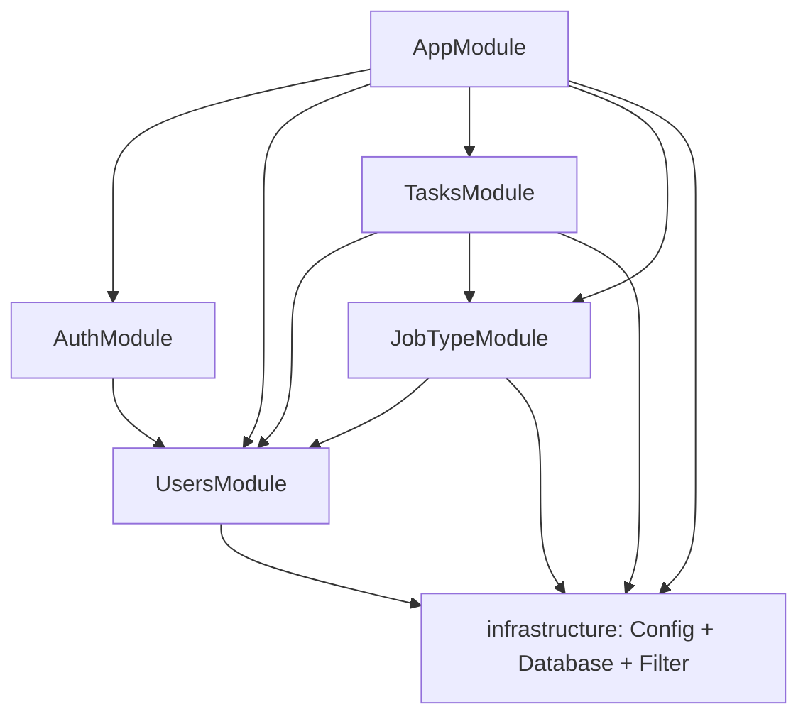

# Modules

> **Summary:** What each feature module owns, its public surface, and how the modules depend on each other.
> **Read this when:** You're changing a specific area and need its boundaries and collaborators.
> **Audience:** both
> **Related:** [Overview](overview.md) · [Data model](data-model.md) · [API Reference](../reference/api.md)

[← Back to docs index](../INDEX.md)

---

## Module map



Each feature module exports the things its collaborators need (mainly its **repository** and selected **DTOs/errors**) through an `index.ts` barrel. `infrastructure` is `@Global()`, so `MainDb` and `IConfig` are available everywhere without re-importing.

## Standard file layout

Every feature module uses the same files:

| File | Purpose |
|------|---------|
| `*.module.ts` | Wires controller, service (via token), and repository (via factory) |
| `*.controller.ts` | HTTP routes + Swagger + guards |
| `*.service.ts` | Business logic; implements the `I*Service` token |
| `*.interface.ts` | The `abstract class I*Service` DI token |
| `*.repository.ts` | TypeORM data access for the entity |
| `*.entity.ts` | TypeORM entity (table schema) |
| `*.dto.ts` | Request/response DTOs with validation + Swagger decorators |
| `*.errors.ts` | Domain `Error` subclasses |
| `index.ts` | Barrel: the module's public exports |

---

## `auth` — `src/auth/`

Authentication and account lifecycle.

- **Routes:** `POST /auth/signin`, `POST /auth/signup`, `POST /auth/signout`, `DELETE /auth/delete`.
- **Service:** `IAuthService` → `AuthService`. Hashes passwords with `bcrypt` at the configured `auth.rounds` cost factor (per-password salt); verifies credentials on sign-in and delete.
- **Guard:** `AuthGuard` (`src/auth/auth.guard.ts`) — the project-wide authentication check used by other modules. It reads the `username` header and confirms the user exists.
- **Depends on:** `UsersModule` (uses `UsersRepository`), `AuthConfig` (the `auth` config slice).
- **Notes:** `signOut` is currently a no-op placeholder; `signin`/`signup` return HTTP `201`. Sign-in reuses the users module's `CreateUserDto` shape conventions — see [ADR-0003](decisions/0003-header-based-authentication.md) and the [API reference](../reference/api.md#auth).

## `users` — `src/users/`

User records and read/update operations. (Creation and deletion live in `auth`.)

- **Routes:** `GET /users`, `GET /users/:username`, `PATCH /users` — the whole controller is behind `AuthGuard`.
- **Service:** `IUsersService` → `UsersService`.
- **Repository:** `UsersRepository` — exported for `auth`, `tasks`, and `job-type` (and `AuthGuard`) to reuse. Includes `findOneByUsernameWithPassword` which explicitly re-selects the `select: false` password column.
- **Entity:** `User` (id, username, password, jobRole, tasks, timestamps).
- **Depends on:** `MainDb`.

## `job-type` — `src/job-type/`

The catalogue of job types a task can reference (e.g. "Bricklaying").

- **Routes:** `GET /job-types`, `GET /job-types/:id`, `POST /job-types`, `PATCH /job-types`, `DELETE /job-types` — all behind `AuthGuard`.
- **Service:** `IJobTypeService` → `JobTypeService`. Enforces unique `name` on create/update.
- **Repository:** `JobTypeRepository` — exported for `tasks` to validate job-type existence.
- **Depends on:** `MainDb`, `UsersModule` (for `AuthGuard`).

## `tasks` — `src/tasks/`

The core domain: a task assigns a **job type** to a **user** and tracks a status lifecycle.

- **Routes:** `GET /tasks`, `GET /tasks/:id`, `POST /tasks`, `PATCH /tasks`, `DELETE /tasks` — all behind `AuthGuard`.
- **Service:** `ITasksService` → `TasksService`. Validates the referenced user and job type before create/reassign; setting `dateOfCompletion` forces status to `Completed`.
- **Repository:** `TasksRepository` — always loads the `user` and `jobType` relations. `findWithCursor(limit, cursor?)` implements cursor pagination via QueryBuilder (`ORDER BY updatedAt DESC, id DESC`); the compound `@Index(['updatedAt', 'id'])` on `Task` covers this sort.
- **Depends on:** `UsersModule` and `JobTypeModule` (uses both repositories), `MainDb`.
- **Status lifecycle:** `ToBeDone` → `InProgress` → `Completed` / `Cancelled` (see [`TaskStatus`](../reference/glossary.md#task-status)).

## `infrastructure` — `src/infrastructure/`

Not a feature; the shared platform. Provides `ConfigModule`, `DatabaseModule`/`MainDb`, and `DomainExceptionFilter`. Covered in the [Overview](overview.md#infrastructure-module) and the relevant ADRs.

---

## Dependency rules

- Feature modules depend **on each other's repositories and DTOs only**, imported through barrels — except entities (see below).
- `UsersModule` is the most depended-upon module (auth, tasks, job-type all use `UsersRepository`, largely for `AuthGuard`).
- No module imports another module's **service implementation** directly — collaboration goes through repositories.

## A note on circular imports

Entities reference each other (`User` ↔ `Task` ↔ `JobType`). **Import sibling entities directly from their entity file, never through the barrel:**

```ts
// ✅ do this
import { Task } from '../tasks/tasks.entity';
// ❌ not this — the barrel pulls in the whole module and creates a cycle that breaks under Jest
import { Task } from '../tasks';
```

The same applies to `tasks.dto.ts`, which imports `UserJobRole` directly from `../users/users.dto` for the same reason. This was a real bug surfaced by the test runner; keep the pattern.

---

*Next: [Data model](data-model.md) · [API Reference](../reference/api.md) · back to the [index](../INDEX.md).*
