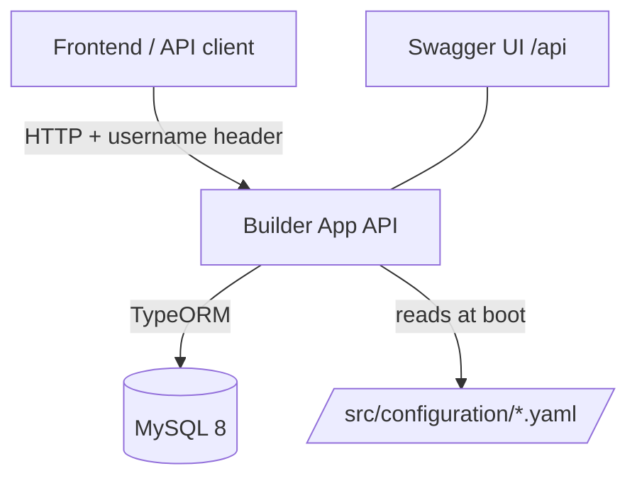
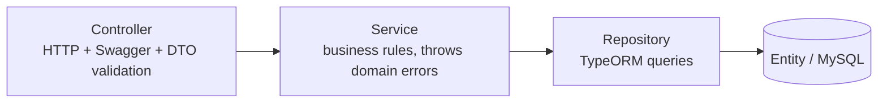

# Architecture Overview

> **Summary:** How Builder App is structured — feature modules over a shared infrastructure layer — and how a request flows from HTTP to MySQL and back.
> **Read this when:** You need the big picture before changing anything non-trivial.
> **Audience:** both
> **Related:** [Modules](modules.md) · [Data model](data-model.md) · [Frontend](frontend.md) · [ADRs](decisions/)

[← Back to docs index](../INDEX.md)

---

## TL;DR

Builder App is a **layered NestJS monolith**. Each business domain (`auth`, `users`, `tasks`, `job-type`) is a self-contained module with the same internal layering: **Controller → Service → Repository → Entity**. A shared `infrastructure` module provides configuration, a single MySQL `DataSource` (`MainDb`), and a global exception filter. The single most important thing to understand: **services talk to abstractions** (`abstract class` tokens and hand-built repositories), and **domain failures are plain `Error` subclasses** that a global filter converts into HTTP responses.

## System context

The API sits between an HTTP client and a MySQL database. There are no queues or third-party services. The HTTP client in this repo is the **React SPA** under `frontend/` (a separate Vite app, allowed via CORS at `FRONTEND_URL`); see [Frontend architecture](frontend.md).

## Layers

Every feature module follows the same four layers. Requests move down; data and domain errors move back up.

| Layer | Responsibility | Example file |
|-------|----------------|--------------|
| Controller | Route, validate DTOs, Swagger metadata, apply `AuthGuard` | `src/tasks/tasks.controller.ts` |
| Service | Business rules, orchestration, throw domain errors | `src/tasks/tasks.service.ts` |
| Repository | Encapsulate TypeORM access for one entity | `src/tasks/tasks.repository.ts` |
| Entity | Table schema + relationships | `src/tasks/tasks.entity.ts` |

See [Modules](modules.md) for what each feature module owns, and [Data model](data-model.md) for the entities.

## Infrastructure module

`src/infrastructure/` is a `@Global()` toolbox the feature modules build on:

| Piece | What it provides | Location |
|-------|------------------|----------|
| `ConfigModule` | `IConfig` (node-config) + `forFeature` to bind a typed config slice to a key | `src/infrastructure/config/` |
| `DatabaseModule` / `MainDb` | One initialised TypeORM `DataSource`, injected into every repository factory | `src/infrastructure/database/` |
| `DomainExceptionFilter` | Global filter mapping domain `Error`s to HTTP responses | `src/infrastructure/filters/` |

## Data flow

A representative write — `POST /tasks` — end to end:

1. Request hits `TasksController.createTask`; `@UseGuards(AuthGuard)` checks the `username` header — `src/tasks/tasks.controller.ts`.
2. The global `ValidationPipe` validates/whitelists the body into a `CreateTaskDto` — configured in `src/main.ts`.
3. `TasksService.createTask` verifies the user and job type exist (throwing `UserNotFoundException` / `JobTypeNotFoundException` if not) — `src/tasks/tasks.service.ts`.
4. `TasksRepository.insert` saves via the `Task` repository obtained from `MainDb` — `src/tasks/tasks.repository.ts`.
5. The service maps the entity to a `TaskResponseDto`; on any failure it throws a domain `Error`, which `DomainExceptionFilter` turns into the right status code — `src/infrastructure/filters/domain-exception.filter.ts`.

## Cross-cutting concerns

- **Configuration:** YAML via `node-config`, bound to typed classes with `ConfigModule.forFeature`. See [Configuration](../reference/configuration.md).
- **Error handling:** domain `Error` subclasses → HTTP by naming convention in a global filter. See [ADR-0004](decisions/0004-domain-exceptions-via-global-filter.md).
- **Auth / security:** a `username` request header validated by `AuthGuard`; passwords hashed with `bcrypt`. JWT is a dependency but not yet wired. See [ADR-0003](decisions/0003-header-based-authentication.md).
- **API docs:** Swagger/OpenAPI generated from decorators, served at `/api` (`src/main.ts`).
- **Bootstrap:** global pipe, global filter, CORS (`FRONTEND_URL`), and Swagger are all configured in `src/main.ts`.

## Key decisions

- [ADR-0001](decisions/0001-record-architecture-decisions.md) — Record architecture decisions
- [ADR-0002](decisions/0002-dependency-injection-with-interface-tokens.md) — DI via abstract-class tokens & repository factories
- [ADR-0003](decisions/0003-header-based-authentication.md) — Header-based authentication
- [ADR-0004](decisions/0004-domain-exceptions-via-global-filter.md) — Domain exceptions via a global filter

---

*Next: [Modules](modules.md) for area-by-area detail, or back to the [index](../INDEX.md).*
